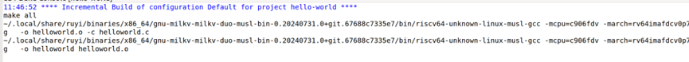

# Ruyi SDK Installation and Usage Guide

## Task 1.1 Installation and Verification

1. **ruyi安装与验证**，基于VMware的Ubuntu 22.04.5系统，使用x86-64指令体系命：
   ```bash
   wget https://mirror.iscas.ac.cn/ruyisdk/ruyi/releases/0.31.0/ruyi.amd64
   ```

2. **赋予下载文件执行权限**：
   ```bash
   chmod +x ./ruyi.amd64
   ```

3. **添加环境变量**：
   ```bash
   sudo cp -v ruyi.amd64 /usr/local/bin/ruyi
   ```

4. **为了在QEMU中运行，首先安装QEMU相关依赖**：
   ```bash
   sudo apt install qemu-system-misc qemu-system-riscv -y
   ```

5. **安装必要依赖**：
   ```bash
   ruyi install llvm-upstream gnu-plct qemu-user-riscv-upstream
   ```

6. **创建虚拟环境**：
   ```bash
   ruyi venv -t llvm-upstream --sysroot-from gnu-plct -e qemu-user-riscv-upstream generic venv. venv/bin/ruyi-activate
   ```

7. **解包coremark并编译**：
   ```bash
   mkdir coremark
   cd coremark
   ruyi extract coremark
   sed -i 's/gcc/riscv64-unknown-linux-gnu-gcc/g' linux64/core_portme.mak
   make PORT_DIR=linux64 link
   ```

8. **通过QEMU运行coremark.exe**：
   ```bash
   ruyi-qemu coremark.exe
   ```
    

## Task 1.2 Installing Toolchain and Building Project

1. **安装工具链**：
   ```bash
   ruyi install toolchain/gnu-milkv-milkv-duo-musl-bin
   ```
   > 注：官方示例文档所用工具链包含-musl，此处的命令行应在查看软件源资源后选择相应的工具链，否则后续虚拟环境无法创建。

2. **创建duo编译环境**：
   ```bash
   ruyi venv -t gnu-milkv-milkv-duo-musl-bin milkv-duo ./venv-milkvduo
   ```

3. **下载helloworld示例源码**：
   ```bash
   git clone https://github.com/milkv-duo/duo-examples.git
   ```

4. **按照要求设置项目并导入源码**。

5. **编辑Makefile**：
   
   > 注：`toolChain`需要修改为上述下载的工具链地址。

6. **由于不需要传输到目标设备，官方文档的upload选项被去除，示例项目编译完成**。
   

## TASK1 意见和改进建议

1. 对于ruyisdk.org左侧导航栏Ruyi包管理器下二级内容“安装”：命令行复制框内存在多余符号`$`，建议将提示符移出到复制框外。

2. 对于Ruyi包管理器下二级内容“管理Ruyi软件包”，“使用案例”：命令行复制框内存在«Ruyi milkv-venv» `$`的虚拟环境提示符，建议将不属于命令行内容的移出复制框外。

3. 对于包管理器下二级内容“更多信息”：卸载Ruyi包管理器中，建议添加：如果用户使用`sudo`命令安装Ruyi后的卸载命令：
   ```bash
   export RUYI_FORCE_ALLOW_ROOT=1
   sudo ruyi self uninstall
   ```
   > 这样可以避免`self uninstall`命令失效。

4. 对于使用案例下的二级内容：Milkv Duo相关内容：文档中的`ruyi install gnu-milkv-milkv-duo-bin`命令会造成创建带-musl的虚拟环境以及编译带-musl编译失败，建议将该命令换成：
   ```bash
   ruyi install toolchain/gnu-milkv-milkv-duo-musl-bin
   ```
   > 以保证后续设置一致。
