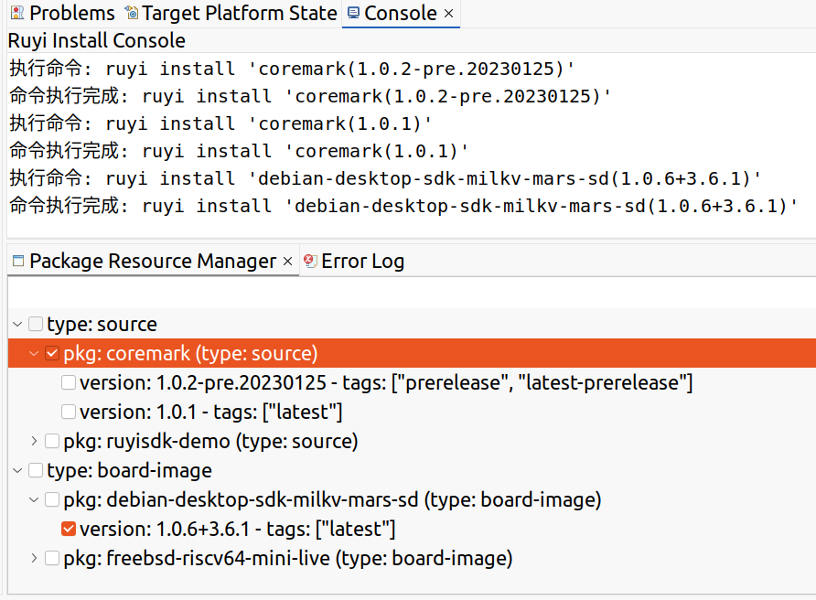

# PackageResourceView 功能说明文档

## 本文件结构下的PackageResourceView.java文件负责该插件的具体实现。
`PackageResourceView` 是一个基于 Eclipse 平台的插件，用于展示和管理设备相关的软件包信息。该视图支持以树形结构显示设备、软件包类型、软件包及其版本信息，并提供复选框功能以选择需要安装的软件包版本。用户可以通过右键菜单执行安装命令。

---

## 功能介绍

1. **树形视图展示：**
   - 按设备、类型、软件包、版本的层级结构展示数据。
   - 支持复选框选择，用户可以选择软件包或具体版本。

2. **命令生成与执行：**
   - 根据用户选择的软件包和版本，生成安装命令，格式为：
     ```
     ruyi install '软件包名称(版本号)'
     ```
   - 在 Eclipse 控制台中执行生成的命令，并实时输出执行结果。

3. **右键菜单操作：**
   - 提供右键菜单，支持一键下载选中的软件包。

4. **模拟数据支持：**
   - 如果命令执行失败或无数据返回，提供模拟的 JSON 数据用于展示。

---

## 实现方法

### 数据结构

- **`DeviceNode`：**
  - 表示设备节点，包含设备名称和子节点（类型节点）。
- **`TypeNode`：**
  - 表示软件包类型节点，包含类型名称和子节点（软件包节点）。
- **`PackageNode`：**
  - 表示软件包节点，包含软件包名称、类型和版本列表。
- **`VersionNode`：**
  - 表示软件包版本节点，包含版本号和标签信息。

### 核心方法

#### 1. **`createPartControl`**
   - 初始化树形视图，设置内容提供者和标签提供者。
   - 调用 `createPackageTree` 方法加载数据。
   - 创建右键菜单。

#### 2. **`createPackageTree`**
   - 执行命令 `ruyi list` 获取设备相关的软件包信息。
   - 解析 JSON 数据，构建树形结构的节点。
   - 支持模拟数据加载。

#### 3. **`createContextMenu`**
   - 创建右键菜单，添加下载操作。
   - 下载操作会根据用户选择的软件包和版本生成安装命令并执行。

#### 4. **`executeCommandInEclipseConsole`**
   - 在 Eclipse 控制台中执行命令并输出结果。
   - 支持实时输出命令执行的日志。

#### 5. **`findParentPackage`**
   - 根据版本节点查找其所属的软件包节点。


### 树形视图结构
    设备: sipeed-lpi4a
      类型: source
        软件包: coremark
          版本: 1.0.2-pre.20230125 - tags: [prerelease, latest-prerelease]
          版本: 1.0.1 - tags: [latest]
      类型: board-image
        软件包: debian-desktop-sdk-milkv-mars-sd
          版本: 1.0.6+3.6.1 - tags: [latest]
### 右键菜单操作
-1.选中`coremark`软件包
   - 会生成并执行以下命令：
     ```
        ruyi install 'coremark(1.0.2-pre.20230125)'
        ruyi install 'coremark(1.0.1)'
     ```
-2.选中`1.0.2-pre.20230125`版本
   - 会生成并执行以下命令：
     ```
        ruyi install 'coremark(1.0.2-pre.20230125)'
     ```
-3.选中多个软件包
   - 会生成并执行以下命令：
     ```
        ruyi install 'coremark(1.0.2-pre.20230125)'
        ruyi install 'coremark(1.0.1)'
        ruyi install 'debian-desktop-sdk-milkv-mars'
     ```
## 插件效果

以下是插件运行时的效果图：




